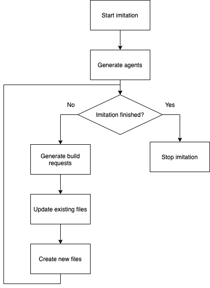
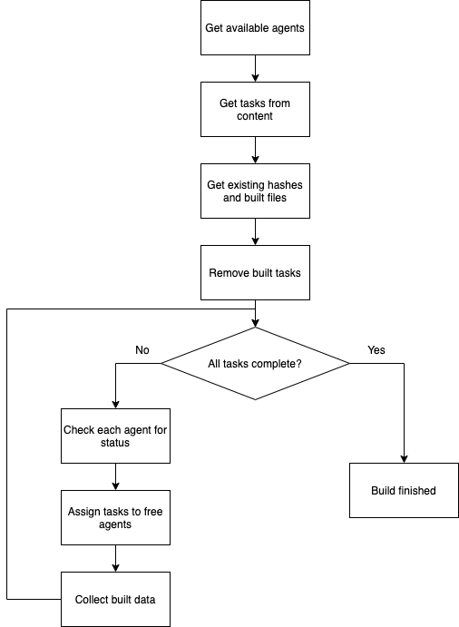

# Исследование перспективы внедрения системы распределнной сборки в современных игровых компаниях

## Методы исследования

1. Сбор тематической литературы
2. Анализ тематической литературы
3. Сбор информации о процессе разработки
4. Проектирование имитационной модели
5. Разработка имитационной модели
6. Сбор показателей с имитационной модели
7. Анализ показателей имитационной модели

## Сбор информации о процессе разработки

В результате анализа процессов разработки ~~в компании SPERASOFT~~ был выделен ряд правил, которые присущи процессу разработки большинства проектов. Эти правила будут использоваться для проектирования имитационной модели.

1. Разработка ведется итеративно и инкрементально. На каждой итерации разработки вносятся небольшие изменения в уже существующие файлы контента.
2. Новые файлы в проекте появляются значительно реже, чем изменяются уже существующие.
3. Для работы в проекте используется сразу несколько версий контента.
4. В компании компьютеры объеденены в локальную сеть, следовательно, скорость передачи контента будет ограничена скоростью локальной сети.
5. Потребность в сборке возникает часто, поэтому необходимо рассчитывать на то, что одновременно может осуществляться большое количество сборок.

## Проектирование имитационной модели

Имитационная модель состоит из двух частей - имитация жизненного цикла проекта и имитация работы распределенной системы сборщиков.

### Имитация работы распределенной системы сборщиков

Проектирование системы, имитирующей работу распределенной системы сборщиков осуществлялось на основе ряда требований, сформированных на основании задач, которые предполагается решать системе ~~(Каких задач?)~~.

1. Система должна позволять осуществлять сборку контента одновременно на нескольких сборщиках-агентах.
2. Система должна кешировать собранный контент и предотвращать повторную сборку одних и тех же частей.

Для обеспечения гибкости в разработке выбрана модульная система на основе интерфейсов. Такой подход позволяет использовать разные типы модулей в зависимости от целей исследования и в будующем позволит при необходимости быстро заменить имитационные модули на реальные.

1. **IContent** - модуль для работы с контентом, подлежащим сборке.
2. **IController** - модуль, реализующий логику работы агента при взаимодействии с пользователем. 
3. **IHashManager** - модуль, реализующий логику обработки хешированных данных.
4. **ILogger** - модуль, реализующий логгирование и вывод сообщений.
5. **INetwork** - модуль, реализующий работу с сетью.
6. **IRemoteAgent** - модуль, реализующий логику работы удаленных агентов
7. **ITask** - модуль, релизующий логику обработки задачи

### Имитация жизненного цикла проекта

Проектирование модели системы, имитирующий жизненный цикл проекта осуществлялось на основе правил, выявленных на этапе сбора информации о процессе разработки.

На вход модели будет поступать проект с уже существующим контентом, который с течением времени будет увеличиваться и изменяться.
1. На каждой итерации работы модели ~~средний %~~ файлов случайно изменяется.
2. На каждой итерации работы модели ~~малый %~~ файлов создается и удаляется.
3. Сборки во время работы модели осущесвляются для более чем одной версии.
4. Сборки во время работы модкли запрашиваются одновременно с нескольких агентов распределенной системы.

Для упрощения работы с графикой эта часть имитационной модели реализована на языке python версии 3.9. Ниже представлена блок-схема имитации жизненного цикла проекта:



Она включает в себя следующие этапы:

1. **Генерация агентов.** Так как на протяжении всего времени жизни проекта агенты-сборщики остаются неизменными, генерация этих агентов происходит один раз в начале работы модели.
2. **Генерация запросов на сборку.** На этом этапе система имитирует запросы на сборку контента от пользователей системы. Создается случайное количество запросов, которые отправляются с уже существующих, заранее сгенерированных, агентов.
3. **Обновление существующих файлов.** Этот этап случайно изменяет ~~средний %~~ файлов контента. Для релизации этого этапа используется модуль на языке python.
4. **Генерация новых файлов.** На этом этапе создется ~~небольшое количество~~ новых файлов проекта. Для релизации этого этапа используется модуль на языке python.

## Разработка имитационной модели

### IContent

Для обработки контента был спроектирован интерфейс IContent, который включает в себя следующие методы:

1. **GetSize** - метод возвращает общий размер занимаемый контентом для сборки.
2. **GetTasks** - метод создает и возвращает набор из задач используя директорию в которой находится контент для сборки.;

В качестве релизации данного интерфейса разработан класс **Content**. Этот класс использует .json файлы для определения типов задач и файлов которые необходимо обработать. Пример json файла.
```json
{
  "file": "tex_1.png",
  "executor": "/Users/evgenijkuratov/CLionProjects/distributed_content_builder/tools/compress_file.py",
  "parameters": ""
}
```

### IController

Для обработки взаимодействий агента с пользвателем был спроектирован интерфейс IController. Он включает в себя следующие методы:

1. **GetAvailableAgents** - получение списка доступных для работы агентов.
2. **BuildContent** - запуск сборки контента. Принимет на вход экземпляр IContent

В качестве реализации этого интерфейса был разработан класс Controller и класс MetricsControllerDecorator.
Controller реализует процесс оркестрации сборки, используя экзэмпляры классов IHashManager и INetwork. Ниже представлена блок схема работы метода BuildContent.



### IHashManager


## Сбор показателей с имитационной модели

Для анализа работы имитационной модели время ее работы собираются следующие показатели:

1. Время сборки - время от запроса пользователем на сборку контента до получения итогового результата.
2. Размер кеша на диске - сколько памяти занимат хранимые для работы программы файлы.
3. Время передачи по сети - время затрачиваемое на передачу по сети.
4. Количество агентов в сети - количество сборщиков в распределенной системе на момент выполнения сборки.

Используя эти показатели можно проследить следующие зависимости:

1. Среднее время сборки проекта.
2. Изменение среднего времени сборки проекта в зависимости от количества агентов в системе.
3. Изменения времени затрачиваемого на передачу по сети в зависимости от количества агентов в системе.
4. Изменение количества кеша на хостах в зависимости от времени жизни проекта.
5. Изменение количества кеша от скорости изменения контента.

## Анализ показателей

