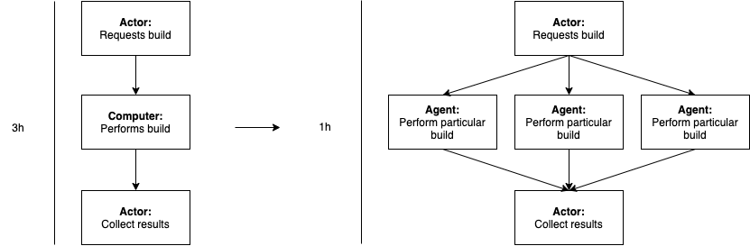
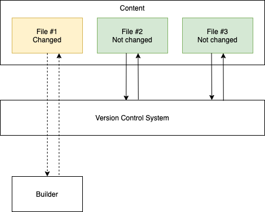
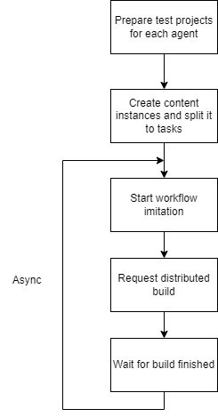
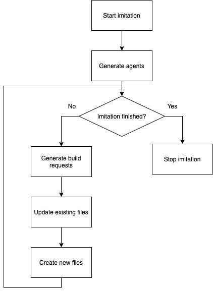
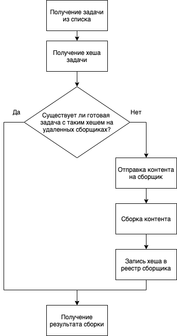
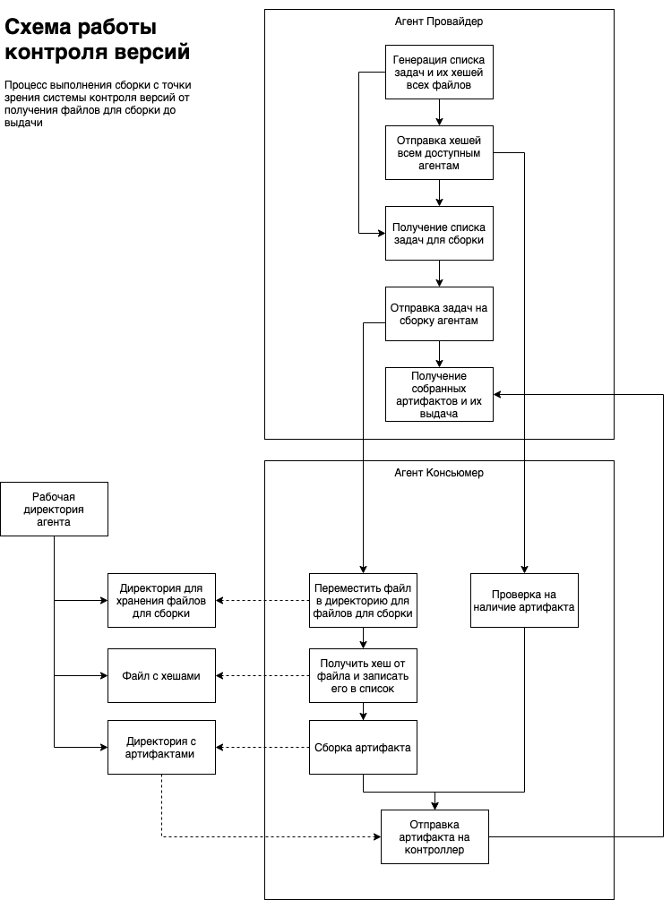
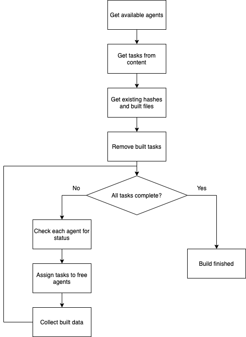

# Исследование перспективы внедрения системы распределнной сборки в современных игровых компаниях

## Идея

Современные компании, занимающиеся разработкой компьютерных игр ААА класса, тратят большое количество времени на сборку своих проектов. 
Одна такая сборка может длиться вплоть до восьми часов. 
В связи с этим, во время работы компании, возникает ряд осложнений, которые влекут за собой снижение эффективности работы команд разработчиков и увеличение стоимости разработки продукта. 
Например, чтобы снизить время ожидания готовой сборки сотрудниками в течении рабочего дня, в некоторых компаниях рабочий процесс организован таким образом, чтобы запуск сборки приходился на конец рабочего дня, 
или ночное время, чтобы к началу следующего сборка уже была завершена. Однако помимо того, что такой процесс накладывает большие ограничения на частоту выполняемых сборок,
он никак не защищает от ошибок происходящих во время сборки. В случае, если сборка завершилась с ошибкой, или не завершилась вовсе её необходимо перезапустить и ожидать ее завершения
продолжительное время. <br><br>
В данной работе предлагается исследовать перспективы внедрению распределенных систем сборки контента в современных компаниях для сокращения времени, затрачиваемого на сборку контента.
Предполагается, что внедрение такой системы позволить снизить временные затраты на сборку проектов, за счет чего будет повышена эффективность работы в команде разработчиков.

## Система распределенной сборки контента
В данной работе предполагается, что улучшение времени сборки будет достигаться за счет параллельного выполнения не зависящих друг от друга задач. Таким образом, например, задача, которая требовала бы 3 часа на сборку на одном сборщике при использовании трех сборщиков, была бы собрана за 1 час.



Однако, в целях дополнительного улучшения времени сборки контента, предлагается использовать встроенную в систему, подсистему контроля версий и кеширования данных. Такая система позволит вместо того, чтобы при каждом запуске сборки, полностью заново собирать весь контент, отследить измениния в в нем и собрать заново только те файлы и компоненты, в которых появились какие-либо изменения.


## Методы исследования

1. Сбор тематической литературы
2. Анализ тематической литературы
3. Сбор информации о процессе разработки
4. Проектирование имитационной модели
5. Разработка имитационной модели
6. Сбор показателей с имитационной модели
7. Анализ показателей имитационной модели

## Сбор информации о процессе разработки

В результате анализа процессов разработки ~~в компании SPERASOFT~~ был выделен ряд правил, которые присущи процессу разработки большинства проектов. Эти правила будут использоваться для проектирования имитационной модели.

1. Разработка ведется итеративно и инкрементально. На каждой итерации разработки вносятся небольшие изменения в уже существующие файлы контента.
2. Новые файлы в проекте появляются значительно реже, чем изменяются уже существующие.
3. Для работы в проекте используется сразу несколько версий контента.
4. В компании компьютеры объеденены в локальную сеть, следовательно, скорость передачи контента будет ограничена скоростью локальной сети.
5. Потребность в сборке возникает часто, поэтому необходимо рассчитывать на то, что одновременно может осуществляться большое количество сборок.

## Проектирование имитационной модели

Для того чтобы проанализировать перспективы внедрения такой системы, разработана модель, имитирующая работу над проектом внутри компании с использованием такой системы. 
Имитационная модель состоит из двух частей - имитация жизненного цикла проекта и имитация работы распределенной системы сборщиков. В рамках имитации жизненного цикла 
предусмотрено моделирование реальной работы разработчиков с проектом - обновление файлов, создание новых, генерация запросов на сборку. Имитация же работы распределенной системы
сборщиков включает в себя имитацию процессов происходящих во время сборки контента в распределенной системе - создание и распределение задач по агентам-сборщикам, передача контента по сети или
непосредственная сбора контента, например.



### Имитация жизненного цикла проекта

Проектирование модели системы, имитирующий жизненный цикл проекта осуществлялось на основе правил, выявленных на этапе сбора информации о процессе разработки.

На вход модели будет поступать проект с уже существующим контентом, который с течением времени будет увеличиваться и изменяться.
1. На каждой итерации работы модели ~~средний %~~ файлов случайно изменяется.
2. На каждой итерации работы модели ~~малый %~~ файлов создается и удаляется.
3. Сборки во время работы модели осущесвляются для более чем одной версии.
4. Сборки во время работы модели запрашиваются одновременно с нескольких агентов распределенной системы.

Для упрощения работы с графикой эта часть имитационной модели реализована на языке python версии 3.9. Ниже представлена блок-схема имитации жизненного цикла проекта:



Она включает в себя следующие этапы:

1. **Генерация агентов.** Так как на протяжении всего времени жизни проекта агенты-сборщики остаются неизменными, генерация этих агентов происходит один раз в начале работы модели.
2. **Генерация запросов на сборку.** На этом этапе система имитирует запросы на сборку контента от пользователей системы. Создается случайное количество запросов, которые отправляются с уже существующих, заранее сгенерированных, агентов.
3. **Обновление существующих файлов.** Этот этап случайно изменяет ~~средний %~~ файлов контента. Для релизации этого этапа используется модуль на языке python.
4. **Генерация новых файлов.** На этом этапе создется ~~небольшое количество~~ новых файлов проекта. Для релизации этого этапа используется модуль на языке python.


### Имитация работы распределенной системы сборщиков

Проектирование системы, имитирующей работу распределенной системы сборщиков осуществлялось на основе ряда требований, сформированных на основании задач, которые предполагается решать системе ~~(Каких задач?)~~.

1. Система должна позволять осуществлять сборку контента одновременно на нескольких сборщиках-агентах.
2. Система должна кешировать собранный контент и предотвращать повторную сборку одних и тех же частей.

#### Распределенная система

Система будет использовать несколько хостов-агентов, между которыми будут распределяться задачи для снижения временных затрат на сборку:


После того как агент, на котором была запрошена сборка (далее контроллер) разобьет контент проекта на задачи, каждая из них будет проходить путь в соответствии со схемой ниже:



Для задачи будет посчитан хеш, используя который система сможет делать выводы о наличии уже собранных частей проекта. В случае если система обнаруживает такую часть, она не тратит время на повторную сборку, а лишь выкачивает уже существующий результат. В противном случае исходный контент по сети передается на агент сборщик, на нем контент собирается, а хеш его исходного файла записывается в реестр. Результат же отправляется на контроллер.
 
#### Контроль версий и кеширование

Для обеспечения контроля версий и кеширования собранного контента была спроектированна специальная система. На рисунке ниже представлена схема работы такой системы.



На схеме:
 - Агент Провайдер - агент на котором запрошена сборка.
 - Агент Консьюмер - агент, который выполняет часть сборки.

Агент провайдер генерирует список задач, включая в них хеши файлов, которые необходимо собрать. Затем, он отправляет хеши всем доступным агентам и получает от них списки уже собранных файлов. Собранные файлы исключаются из списка задач, и после задачи распределяются по агентам для сборки.
Агент консьюмер имеет два сценария работы в этом случае:
 - **Получение задачи** - про получении задачи, агент консьюмер перемещает полученный файл в директорию для хранения файлов подлежащих сборки, получает и записывает его хеш-сумму и запускает сборку. По окончании сборки результат отправляется агенту провайдеру.
 - **Получение списка хешей** - при получении списка хешей, агент проверяет свой кеш на наличие собранных артифактов нужной версии (по хеш-сумме не собранного файла), и отправляет отчет о результате и готовые артифакты провайдеру.

#### Модульная система

Для обеспечения гибкости в разработке выбрана модульная система на основе интерфейсов. Такой подход позволяет использовать разные типы модулей в зависимости от целей исследования и в будующем позволит при необходимости быстро заменить имитационные модули на реальные.

1. **IContent** - модуль для работы с контентом, подлежащим сборке.
2. **IController** - модуль, реализующий логику работы агента при взаимодействии с пользователем. 
3. **IHashManager** - модуль, реализующий логику обработки хешированных данных.
4. **ILogger** - модуль, реализующий логгирование и вывод сообщений.
5. **INetwork** - модуль, реализующий работу с сетью.
6. **IRemoteAgent** - модуль, реализующий логику работы удаленных агентов
7. **ITask** - модуль, релизующий логику обработки задачи

## Разработка имитационной модели

### IContent

Для обработки контента был спроектирован интерфейс IContent, который включает в себя следующие методы:

1. **GetSize** - метод возвращает общий размер занимаемый контентом для сборки.
2. **GetTasks** - метод создает и возвращает набор из задач используя директорию в которой находится контент для сборки.;

В качестве релизации данного интерфейса разработан класс **Content**. Этот класс использует .json файлы для определения типов задач и файлов которые необходимо обработать. Пример json файла.
```json
{
  "file": "tex_1.png",
  "executor": "/Users/evgenijkuratov/CLionProjects/distributed_content_builder/tools/compress_file.py",
  "parameters": ""
}
```

### IController

Для обработки взаимодействий агента с пользвателем был спроектирован интерфейс IController. Он включает в себя следующие методы:

1. **GetAvailableAgents** - получение списка доступных для работы агентов.
2. **BuildContent** - запуск сборки контента. Принимет на вход экземпляр IContent

В качестве реализации этого интерфейса был разработан класс Controller и класс MetricsControllerDecorator.
Controller реализует процесс оркестрации сборки, используя экзэмпляры классов IHashManager и INetwork. Ниже представлена блок схема работы метода BuildContent.



### IHashManager

Для реализации логики управления хешированными данными был разработан интерфейс IHashManager. Он включает в себя следующие методы:

1. **GetArtifactsFromHashlist** - метод для поиска уже существующих артифактов на сборщике по предоставленному списку хешей артифактов подлежащих к сборке.
2. **GenerateFileHash** - метод для генерации хеш-суммы для файла

В качестве реализации этого интерфейса был разработан класс HashManager.

### ILogger

Для реализации централизованного логгирования и вывода сообщений был разработан интерфейс ILogger

Онвключает в себя виртуальный метод:
PushMessage(LogLevel level, std::string msg) - универсальный метод для отправки сообщения

А также реализацию следующих методов:

```c++
    void LogDebug(std::string&& message){
        PushMessage(Debug, message);
    };
    
    void LogInfo(std::string&& message){
        PushMessage(Info, message);
    };
    
    void LogSuccess(std::string&& message){
        PushMessage(Success, message);
    };
    
    void LogWarning(std::string&& message){
        PushMessage(Warning, message);
    };
    
    void LogError(std::string&& message) {
        PushMessage(Error, message);
    };
```

В качестве релизации данного интерфейса были разработаны классы MacLogger и Unix логгер для операционных систем Mac OS и Linux соответственно. 

### IRemoteAgent

Интерфейс, реализующий логику работы удаленных агентов.

В интерфейс удаленного агента закладываются состояния, которые агент может принимать, список полей агента и его методы.

**Состояния:**
 - STATE_AVAILABLE - агент доступен и может выполнять задачи 
 - STATE_BUSY - агент занят выполнением задачи
 - STATE_OFFLINE - агент не доступен
 - STATE_TASK_COMPLETE - агент завершил выполнение задачи и готов приступать к следующей.

**Методы:**
1. **DoTask** - выполнить переданную задачу.
2. **CheckHashes** - проверить наличие собранных задач на агенте.

### ITask

Интерфейс, реализующий логику выполнения задачи.

**Методы:**
1. **GetStatus** - получить состояние задачи.
2. **SetStatus** - обновить состояние задачи.
3. **GetSize** - получить размер файла задачи.
4. **Do** - выполнить задачу.

## Сбор показателей с имитационной модели

Для анализа работы имитационной модели время ее работы собираются следующие показатели:

1. Время сборки - время от запроса пользователем на сборку контента до получения итогового результата.
2. Размер кеша на диске - сколько памяти занимат хранимые для работы программы файлы.
3. Время передачи по сети - время затрачиваемое на передачу по сети.
4. Количество агентов в сети - количество сборщиков в распределенной системе на момент выполнения сборки.

Используя эти показатели можно проследить следующие зависимости:

1. Среднее время сборки проекта.
2. Изменение среднего времени сборки проекта в зависимости от количества агентов в системе.
3. Изменения времени затрачиваемого на передачу по сети в зависимости от количества агентов в системе.
4. Изменение количества кеша на хостах в зависимости от времени жизни проекта.
5. Изменение количества кеша от скорости изменения контента.

## Анализ показателей

