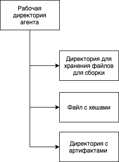
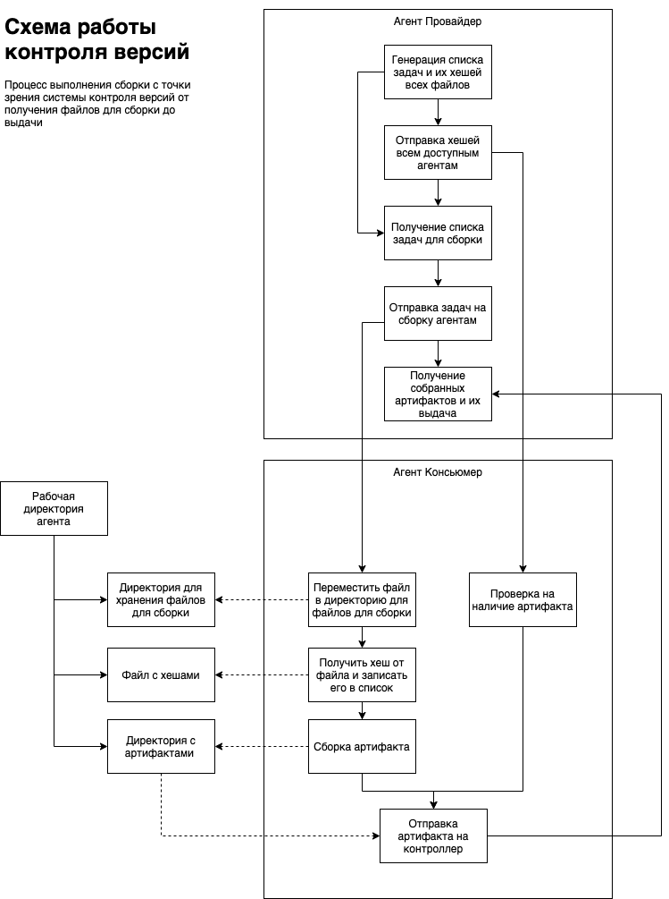

## Распределенная система сборки контента

??? Написать про агентность системы? <br>
??? Написать про формат предоставляемого контента?

Распределенная система сборки контента предназначена для ускорения процесса сборки контента за счет использования нескольких вычислительных центров для решения одной задачи.

Такая система выполняет следующие задачи:

 - Хранение версий собранного контента
 - Выделение минимальной разницы между контентом подлежащим сборке и хранящимся в системе на данный момент
 - Генерация списка задач для выполнения сборки
 - Распределение задач между агентами системы 
 - Сборка контента с использованием удаленных сборщиков-агентов

Предполагается, что выполняя поставленные задачи система будет обеспечивать прирост в скорости сборки контента.

### Хранение версий

С целью минимизации количества времени, затрачиваемого на сборку контента система хранит в себе результаты предыдущих сборок за определенный промежуток времени. Таким образом, вместо того, чтобы при каждой сборки затрачивать время на полноценную сборку контента, который с прошлой версии остался без изменений системе будет лишь необходимо предоставить его в уже собранном виде запросившему сборку пользователю и время на сборку таких частей проекта сократиться до времени передачи по сети соответствующих частей контента.

Ограничение на время хранение собранного контента может быть установлено в трех режимах:

 - Жесткий - контент удаляется по истечению определенного срока
 - Интеллектуальный - контент удаляется по истечение определенного срока, если не было использован в течение этого срока
 - Свободный - контент не удаляется из системы вообще

#### Показатели

Важными показателями для этой части системы будут следующие метрики:

- Общий объем данных, хранимых в системе на каждый момент времени, или зависимость количества данных в системе от времени ее жизни
- Зависимость общего объема данных хранимых в системе на каждый момент времени от режима хранения контента
- Зависимость среднего времени сборки контента от режима хранения контента в системе
- Средний объем данных хранимый на одном агенте

#### Техническая реализация

На каждом агенте подключенном к системе существует директория рабочая директория, которая имеет следующую структуру:



- Директория для хранения файлов для сборки содержит в себе несобранный контент во время работы сборщика, в остальное время эта директория пустая.
- Директория с артифактами содержит результаты сборки контента, который был собран на данном агенте. Именно в этой директории хранение контента описывается режимами, описанными выше. 
- Файл с хешами содержит в себе список собранных файлов, хранящихся на агенте и хешей, соответствующих этим же файлам в несобранном состоянии. Пример содержания такого файла:

```
/Users/evgenijkuratov/CLionProjects/distributed_content_builder/cmake-build-debug/distributed_content_builder/../../test_content/agents//RemoteAgent0/ready/tex_1.png 4df9723f643893b5575cf55fd18ea34c
/Users/evgenijkuratov/CLionProjects/distributed_content_builder/cmake-build-debug/distributed_content_builder/../../test_content/agents//RemoteAgent0/ready/tex_4.png 4df9723f643893b5575cf55fd18ea34c
```

Пример рабочей директории агента:


### Выделение минимальной разницы

С целью минимизации количества времени, затрачиваемого на сборку контента система стремится к тому, чтобы собирать только такой контент, который никогда до этого не был собран. Перед системой в стает задача проанализировать уже существующий в ней контент и выделить из него минимальную разницу, которую необходимо будет собрать. Для этого система сгенерирует список хешей каждого файла подлежащего сборке, затем разошлет его по агентам и в ответ получит список файлов, которые не были собраны, а также результаты сборки существующих файлов. Таким образом, вместо того, чтобы при каждой сборки затрачивать время на полноценную сборку контента, который с прошлой версии остался без изменений системе будет лишь необходимо предоставить его в уже собранном виде запросившему сборку пользователю и время на сборку таких частей проекта сократиться до времени передачи по сети соответствующих частей контента.

#### Показатели

Важными показателями для этой части системы будут следующие метрики:

 - Среденее время, затрачиваемое системой на сетевые взаимодействия

#### Техническая реализация



На схеме:
- Агент Провайдер - агент на котором запрошена сборка.
- Агент Консьюмер - агент, который выполняет часть сборки.

Агент провайдер генерирует список задач, включая в них хеши файлов, которые необходимо собрать. Затем, он отправляет хеши всем доступным агентам и получает от них списки уже собранных файлов. Собранные файлы исключаются из списка задач, и после задачи распределяются по агентам для сборки.
Агент консьюмер имеет два сценария работы в этом случае:
- **Получение задачи** - про получении задачи, агент консьюмер перемещает полученный файл в директорию для хранения файлов подлежащих сборки, получает и записывает его хеш-сумму и запускает сборку. По окончании сборки результат отправляется агенту провайдеру.
- **Получение списка хешей** - при получении списка хешей, агент проверяет свой кеш на наличие собранных артифактов нужной версии (по хеш-сумме не собранного файла), и отправляет отчет о результате и готовые артифакты провайдеру.

### Генерация списка задач

Для правильного анализа и получения минимальной разницы системе требуется разбить контент проекта, подлежащий сборке 
на задачи. На данный момент система идентифицирует файл как задачу при помощи вспомогательного файла json с информацией о том, 
как этот файл необходимо обрабатывать.  

На примере ниже представлен файл tex_1.json, в котором 
file - файл, который необходимо обработать
executor - путь до инструмента, при помощи которого файл обрабатывается
parameters - дополнительные параметры, которые нужно передать инструменту при обработке файла

```json
{
  "file": "tex_1.png",
  "executor": "/Users/evgenijkuratov/CLionProjects/distributed_content_builder/tools/compress_file.py",
  "parameters": ""
}
```

На текущий момент система может обрабатывать только задачи сжатия, однако для расширения функционала системы 
предоставлен интерфейс ITask, который позволяет реализовать любую обработку файла.

### Распределение задач между агентами

Одной из наиболее важных задач является распределение задач между агентами. Такая задача направлена на решение нескольких 
проблем. Первая проблема - при неправильном распределении задач между агентами, количество которых меньше количества задач 
время сборки увеличивается. Вторая - значительное снижение скорости сборки конкретного проекта при параллельной сборке нескольких версий.

Для решения поставленной задачи система формирует очередь. В рамках этой очереди на агентах в первую очередь выполняются задачи тех агентов, 
которые раньше запросили сборку. Таким образом ситуация, в которой задачи следующей сборки начинают выполняться раньше
задач текущей и замедляют сборку, не происходит.

#### Показатели

Важными показателями для этой части системы будут следующие метрики:

 - Среднее время ожидания старта сборки
 - Зависимость времени ожидания старта сборки от количества запускаемых сборок на единицу времени
 - Среднее время сборки
 - Зависимость общего времени сборки от количества сборок за единицу времени


